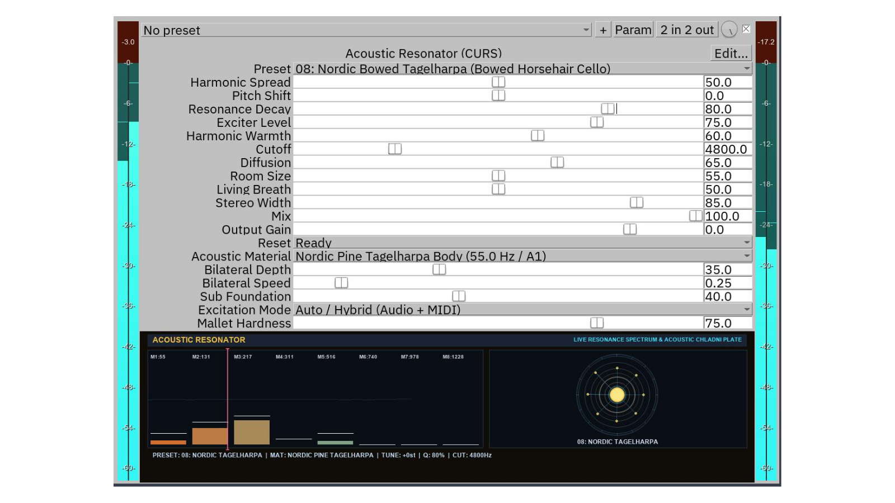

# Currenari Sounds - JSFX Audio Plugin Suite (CURS-jsfx)

**Publisher:** Currenari Sounds  
**Website:** https://currenari.com  
**Supported Sampling Rates:** 44.1 kHz, 48.0 kHz, 88.2 kHz, 96.0 kHz, 176.4 kHz, 192.0 kHz (Linux, macOS, Windows)

---

## Acoustic Resonator (CURS)

**Version:** 2.9.4  
**Category:** Resonators & Synthesizers  
**File:** acoustic_resonator

Acoustic Resonator is an 8-mode acoustic resonator and synthesizer designed for sound design and music production. It transforms input audio or internal synthesis into resonant acoustic bodies with natural damping, diffusion, and low-end reinforcement.

---

### Features & Controls

- **8-Voice Resonant Modal Bank**: 8 tuned resonance modes with decay control.
- **17 Acoustic Materials**:
  1. Terracotta Ceramic Pot
  2. Hand-Hammered Singing Bronze (180 Hz)
  3. Quartz Crystal Glass Harmonica (220 Hz / A3)
  4. Hollow Resonant Spruce Body (110 Hz / A2)
  5. Celtic Drone Wood (Low B 61.7 Hz / B1)
  6. Aged Hollow Oak Timber (58.2 Hz / A#1)
  7. Nordic Pine Tagelharpa Body (55.0 Hz / A1)
  8. Hollow Eucalyptus Didgeridoo (73.4 Hz / D2)
  9. Gothic Chamber Cello (65.4 Hz / C2)
  10. Petrified Bog Ash Log (51.9 Hz / G#1)
  11. Resonant Cedar Frame Rim (69.3 Hz / C#2)
  12. Rosewood Marimba Bar (82.4 Hz / E2)
  13. Basalt Stone Cavern Chamber (48.0 Hz)
  14. Tolling Cast Cathedral Bell (110 Hz / A2)
  15. Forged Celtic Carnyx War Horn (87.3 Hz / F2)
  16. Subterranean 32ft Organ Pipe (32.7 Hz / C1)
  17. Scandinavian Pine Lyre Cavity (73.4 Hz / D2)
- **16 Acoustic Presets**: Presets for ceramic chambers, metal bowls, wood bodies, bowed strings, bells, and organ pipes.
- **Excitation Modes**:
  - Mallet Strike: Clean strike transient with adjustable hardness and velocity response.
  - Bowed Friction: Continuous bowed sound with MIDI gate and sustain pedal support.
  - Hybrid / Audio Input: Process live audio tracks through the resonator.
- **16-Tap Velvet Cloud Diffuser**: Multi-tap acoustic diffusion space.
- **Sub Foundation**: Low-frequency reinforcement.
- **Real-Time Visualizer**: 8-mode spectrum display, cutoff needle, and Chladni resonance plate.
- **Output Safety**: True Peak limiter calibrated <= -3.0 dBFS.

---

### Audio Demos

Audio samples and sound library demos are available at [https://currenari.com](https://currenari.com).

---

### Installation

#### Method 1: Direct Download (Standard)
1. Download the `acoustic_resonator` file from this repository.
2. In REAPER, click **Options** -> **Show REAPER resource path in explorer/finder**.
3. Open the **`Effects`** folder.
4. Drop `acoustic_resonator` directly into `Effects` (or create a `Currenari` subfolder).
5. In REAPER, open the FX Browser (press `Shift + F` or `Insert FX`), press **`F5`** to refresh/scan, and search for `Acoustic Resonator (CURS)`.

#### Method 2: ReaPack (Optional for ReaPack Users)
If you have the ReaPack extension installed in REAPER:
1. In REAPER, open **Extensions** -> **ReaPack** -> **Manage repositories...**
2. Click **Import/export** -> **Import repositories...** and paste:
   `https://raw.githubusercontent.com/currenari-dev/CURS-jsfx/main/index.xml`
3. Click **OK**, then browse and install via **Extensions** -> **ReaPack** -> **Browse packages**.

---

### License & Terms of Use

**Free for Private and Commercial Use.**

- **Music & Audio Production:** 100% free and royalty-free for use in any personal, commercial, film, game, streaming, broadcast, or sound design projects.
- **Usage Rights:** No license fees, no subscriptions, and no royalties required.
- **Redistribution:** You may not resell or redistribute the plugin source files as a standalone commercial product without explicit written permission from Currenari Sounds.

(C) 2026 Currenari Sounds (https://currenari.com). All rights reserved.
